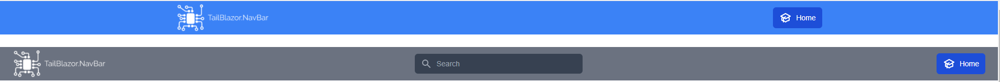
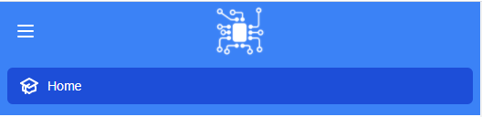

# TailBlazor.NavBar

Blazor NavBar is a basic yet customizable NavBar component for Tailwindcss

Without passing anything to it you will get a default styling, with a background of `bg-blue-500`. However you still have full capability of styling and customization on your end at any point in time.

It has the ability to be a single section or multiple for easy customization.






# Getting Setup

You can install the package via the NuGet package manager just search for TailBlazor.NavBar. You can also install via powershell using the following command.

`Install-Package TailBlazor.NavBar`

Or via the dotnet CLI.

`dotnet add package TailBlazor.NavBar`

## 1. Add Imports

Add line to your \_Imports.razor

```
@using TailBlazor.NavBar
```

## 2. Create NavBar Component

Simply open up a component and add your content.

```
<NavBar>
    <NavBarContent>
        <LeftNavBarItem LogoInformation="new NavLogoInformation()" Items="new List<NavItem>()"></LeftNavBarItem>
    </NavBarContent>
    <MobileNavBarContent Items="new List<NavItem()>"></NavBarItem>
</NavBar>
```

If you would like to add custom content, instead of using the default list of NavItems, then all you have to do is add one or all of the children to the navbar content.
```
<NavBar>
    <NavBarContent>
        <LeftNavBarItem>
            ...
        </LeftItem>
        <CenterNavBarItem>
            ...
        </CenterItem>
        <RightNavBarItems>
            ...
        </RightNavBarItem>
    </NavBarContent>
    <MobileNavBarContent>
        ...
    </MobileNavBarContent>
</NavBar>
```

**NOTE: You can only use one of the Items or ChildContent at a time for each component. If you use both a WarningException will be thrown.**

Example (The below code is not allowed): 

```
    <LeftNavBarItem Items="new List<NavItem>()">
        <a>Link</a>
    </LeftNavBarItem>
```

## 3. Adding MobileMenuButtonOnClick to trigger mobile menu open and close

This allows you to open and close the mobile menu section, you will need a reference to the `MobileNavBarContent` component so that we can trigger the state change in that component. If you don't include the `MobileNavBarContent` component then there is no need to use the `MobileMenuButtonOnClick`.

```
<NavBar>
    <NavBarContent MobileMenuButtonOnClick="() => MobileNavBarContentRef.HamburgerClicked()">
        <LeftNavBarItem LogoInformation="new NavLogoInformation()" Items="new List<NavItem>()"></LeftNavBarItem>
    </NavBarContent>
    <MobileNavBarContent @ref="MobileNavBarContentRef" Items="new List<NavItem()>"></NavBarItem>
</NavBar>

@code {
    MobileNavBarContent MobileNavBarContentRef;
}
```

## Additional Information

We set the default `background-color` for the navbar as `bg-blue-500`, from [TailWindCss(Background Color)](https://tailwindcss.com/docs/background-color). If you would like to change your default background color, just add a class of `.color-primary` to your css file, or just add the `Class` parameter to the `<NavBar>` component.

### Changing primary colors when using the `Items` parameter in the components.
If you would like to add a different active class for the nav items, then just add `.color-primary-active` to your css file, or just input your class into the `ActiveItemClass` in the `NavItem` model. Lastly, if you would like to change the primary hover color for the nav items, then add `colorPrimaryHover` into your `tailwind.config.js` file. The default background-color for an active class or on hover is `bg-blue-700`.

## Components

### ```<NavBar>```
---
This is just the main `<nav></nav>` container.
<br/>

Parameter | Type | Default Value | Description
--- | --- | --- | ---
`Class` | `String` | `bg-blue-500 color-primary` | The container class for the nav.
`ChildContent` | `RenderFragment` | `N/A` | The children content for the navbar. You can use `<NavBarContent>` or `<MobileNavBarContent>`. Otherwise you can input your own custom code here.

### ```<NavBarContent>```
---

<br/>

This is nothing but the main div that holds all the content for the navbar, excluding the mobile content which is seperate from this component.

Parameter | Type | Default Value | Description
--- | --- | --- | ---
`Class` | `String` | `{(!MaxWidthFull ? "max-w-7xl" : "max-w-full")} mx-auto px-2 sm:px-6` | The main div containter class. This is where you can set width, padding etc... If `MaxWidthFull` is true then we don't set a max-width.
`MobileMenuButtonClass` | `String` | `inline-flex items-center justify-center p-2 rounded-md text-white hover:text-white hover:bg-blue-700 hover:bg-colorPrimaryHover focus:outline-none focus:ring-2 focus:ring-inset focus:ring-white` | The mobile menu button class, button will only show on mobile views. `colorPrimaryHover` needs to be set in your `tailwind.config.js` to take effect.
`MaxWidthFull` | `Boolean` | `False` | A flag to check if the navbar will have no max-width or max-width of 80rem.
`MobileMenuButtonPosition` | `MobileMenuButtonPosition [Enum]` | `MobileMenuButtonPosition.Left` | The mobile menu button position, either left or right.
`MobileMenuButtonContent` | `RenderFragment` | `N/A` | The mobile menu button content, in case you would like to change the buttons that are used for the hamburger menu.
`ChildContent` | `RenderFragment` | `N/A` | The children content for the navbar. You can use `<LeftNavBarItem>`, `<CenterNavBarItem>` or `<RightNavBarContent>`. Otherwise you can input your own custom code here.
`MobileMenuButtonOnClick` | `Action` | `N/A` | An action to open the mobile menu section. <br/></br/> **Note:** You will need to have ` <MobileNavBarContent>` component for this to work.

### ```<LeftNavBarItem>```
---

<br/>

This holds all the nav items for the left side of the navbar.

Parameter | Type | Default Value | Description
--- | --- | --- | ---
`Class` | `String` | `flex-1 flex items-center justify-center sm:items-stretch sm:justify-start` | The left items container class.
`LogoInformation` | `NavLogoInformation` | `N/A` | The logo information, such as fullwidthsizeurl, mobilesizeurl, alt, class.
`Items` | `List<NavItem>` | `N/A` | A list of nav items to be placed.This will automatically place a list of items in the navbar without having to do any custom work. If `ChildContent` is passed you don't have to add `Items`.
`ChildContent` | `RenderFragment` | `N/A` | The children content for the left navbar. If `Items` is passed you don't have to add `ChildContent`.

### ```<CenterNavBarItem>```
---

<br/> 

This holds all the nav items for the center side of the navbar.

Parameter | Type | Default Value | Description
--- | --- | --- | ---
`Class` | `String` | `hidden flex-1 items-center justify-center sm:flex sm:items-stretch sm:justify-center` | The center items container class.
`LogoInformation` | `NavLogoInformation` | `N/A` | The logo information, such as fullwidthsizeurl, mobilesizeurl, alt, class.
`Items` | `List<NavItem>` | `N/A` | A list of nav items to be placed.This will automatically place a list of items in the navbar without having to do any custom work. If `ChildContent` is passed you don't have to add `Items`.
`ChildContent` | `RenderFragment` | `N/A` | The children content for the center navbar. If `Items` is passed you don't have to add `ChildContent`.

### ```<RightNavBarItem>```
---
<br/>

This holds all the nav items for the right side of the navbar.

Parameter | Type | Default Value | Description
--- | --- | --- | ---
`Class` | `String` | `hidden flex-1 items-center justify-center sm:flex sm:items-stretch sm:justify-end` | The right items container class.
`LogoInformation` | `NavLogoInformation` | `N/A` | The logo information, such as fullwidthsizeurl, mobilesizeurl, alt, class.
`Items` | `List<NavItem>` | `N/A` | A list of nav items to be placed.This will automatically place a list of items in the navbar without having to do any custom work. If `ChildContent` is passed you don't have to add `Items`.
`ChildContent` | `RenderFragment` | `N/A` | The children content for the right navbar. If `Items` is passed you don't have to add `ChildContent`.

### ```<MobileNavBarContent>```
---
&nbsp;

This is the main div for the mobile content, that we toggle on and off based on when the user clicks the mobile menu button.

Parameter | Type | Default Value | Description
--- | --- | --- | ---
`Class` | `String` | `N/A` | Container class
`Items` | `List<NavItem>` | `N/A` | A list of nav items to be placed.This will automatically place a list of items in the navbar without having to do any custom work. If `ChildContent` is passed you don't have to add `Items`.
`ChildContent` | `RenderFragment` | `N/A` | The mobile content, this will show up when in mobile view and you have clicked the hamburger menu to open.

## Enums

### ```NavLogoPosition```
Parameter | Value
--- | --- 
`Undefined` | `0` 
`Left` | `1` 
`Center` | `2`
`Right` | `3`

### ```NavPosition```
Parameter | Value
--- | --- 
`Undefined` | `0` 
`Left` | `1`
`Center` | `2`
`Right` | `3`

### ```MobileMenuButtonPosition```
Parameter | Value
--- | --- 
`Undefined` | `0` 
`Left` | `1`
`Right` | `2`

### ```NavLinkTarget```
Parameter | Value
--- | --- 
`Undefined` | `0` 
`Blank` | `1`
`Self` | `2`
`Parent` | `3`
`Top` | `4`

## Models

### ```NavLogoInformation```
Parameter | Type | Description
--- | --- | ---
`FullScreenUrl` | `String` | The image url for the navbar logo on fullscreen. `Screen size: < 1024px`
`MobileScreenurl` | `String` | The image url for the navbar logo on mobile screen. `Screen size: >= 1024px`
`Alt` | `String` | The `Alt` attribute provides alternative information for an image if a user for some reason cannot view it (because of slow connection, an error in the src attribute, or if the user uses a screen reader).
`Class` | `String` | The classes for the `` element.

### ```NavItem```
Parameter | Type | Description
--- | --- | ---
`Id` | `String` | A guid string that gets initialized.
`Name` | `String` | The name of the nav item.
`Class` | `String` | The classes for the `<a></a>` element.
`Href` | `String` | The location to redirect the user to.
`ActiveItemsClass` | `String` | Custom class for your active item, if you don't like the default. <br/> `Default: {(navItem.HasIcon ? "flex items-center gap-x-2" : "")} bg-blue-700 color-primary-active text-white px-3 py-2 rounded-md text-sm font-medium`
`PreventDefaultClick` | `Boolean` | Prevents a default on click fore the `<a></a>` element.
`Target` | `NavLinkTarget [Enum]` | The target for the `<a></a>` element. See `NavLinkTarget` enum for more info.
`Action` | `Action` | The action for the onclick event on the `<a></a>` element.
`HasIcon` | `Boolean` | A flag to check if this `NavItem` has an icon.
`Icon` | `RenderFragment` | The icon for the `NavItem`. This allows users to pass another component, or just raw html.
